# 🎨 MVP ImuChat - Architecture Visuelle

> Diagrammes architecturaux et flux features

---

## 📐 Architecture Système Globale

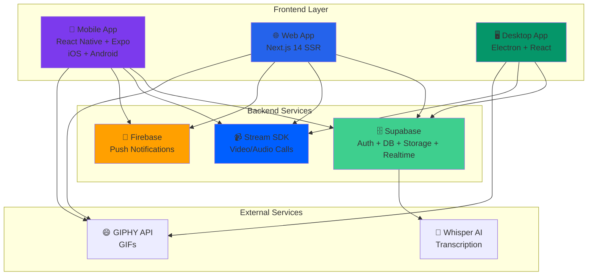

---

## 🗃️ Database Schema (Simplifié MVP)

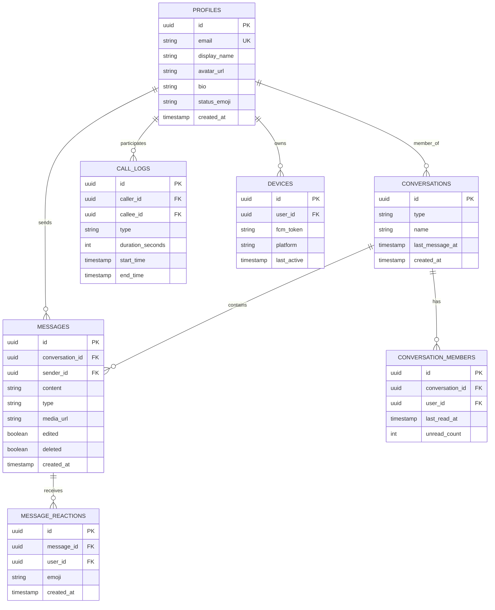

---

## 🔄 User Journey - Première Utilisation

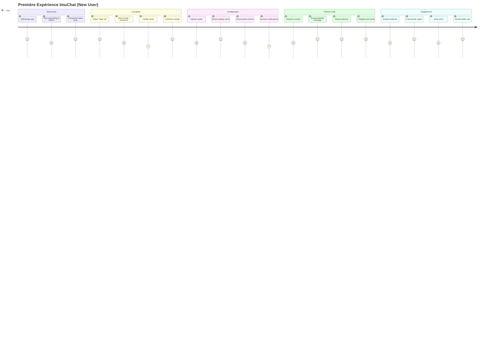

---

## 📊 Timeline Features - 12 Semaines

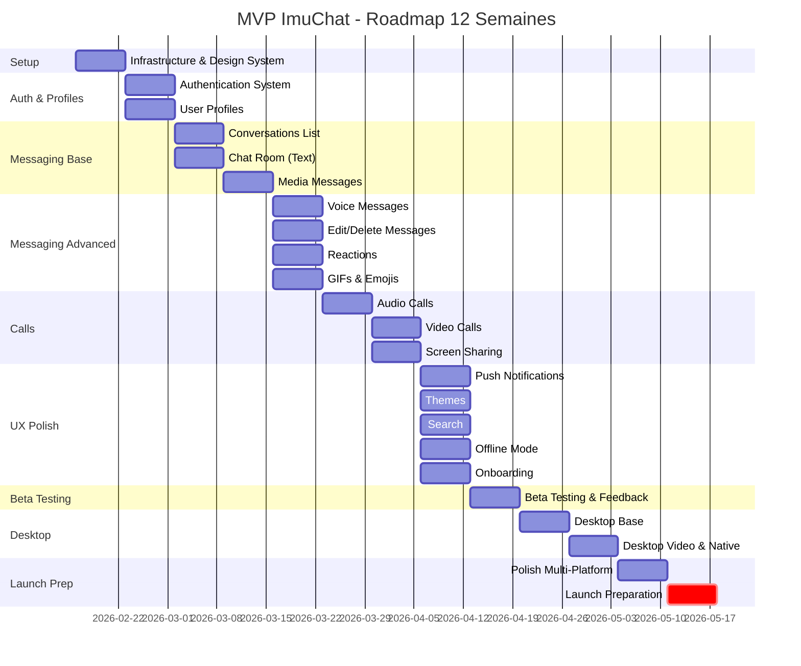

---

## 🔀 Message Flow - Temps Réel

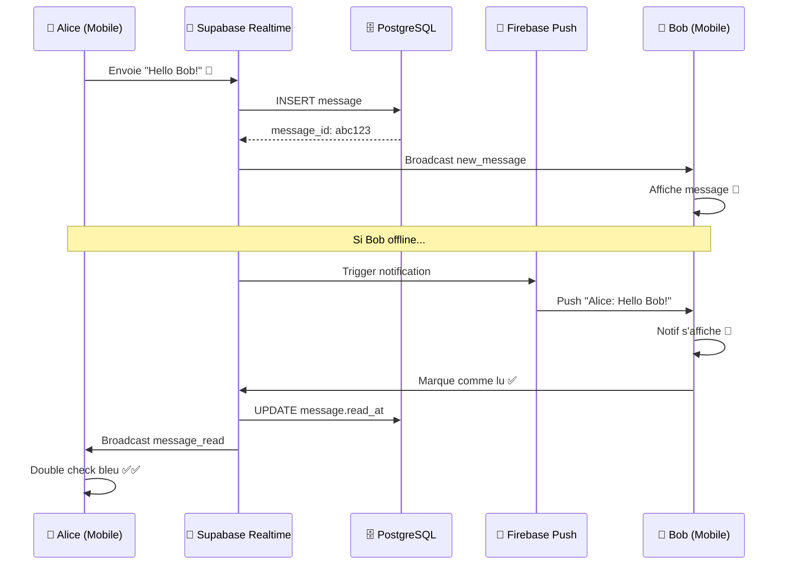

---

## 📞 Call Flow - WebRTC

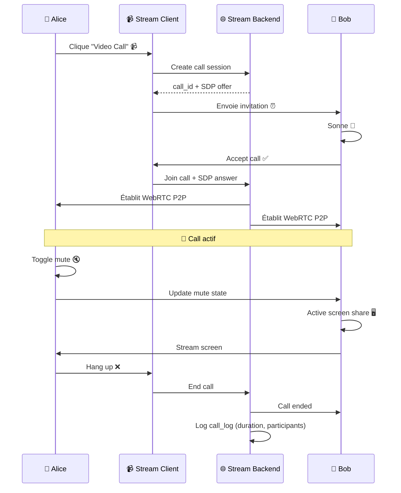

---

## 🔐 Auth Flow - Supabase

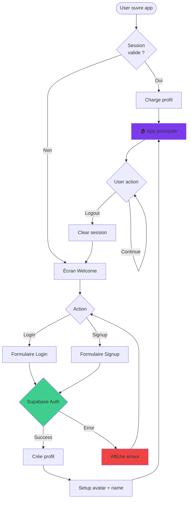

---

## 🎨 Component Hierarchy - Mobile

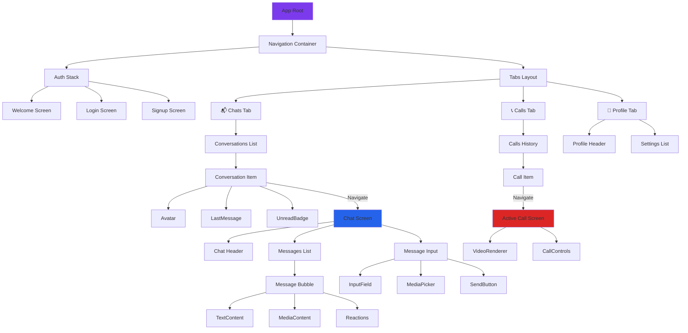

---

## 🔄 State Management - Stores

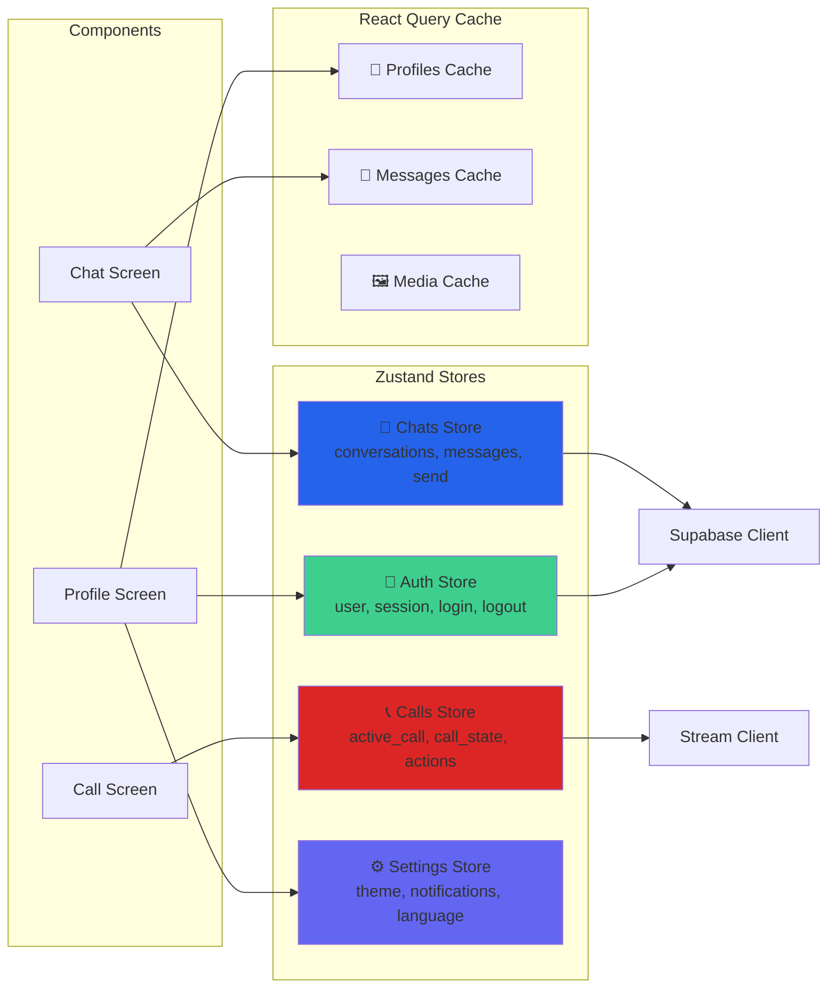

---

## 📦 Feature Modules - Architecture

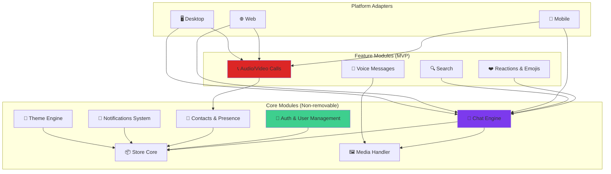

---

## 🚀 Deployment Pipeline

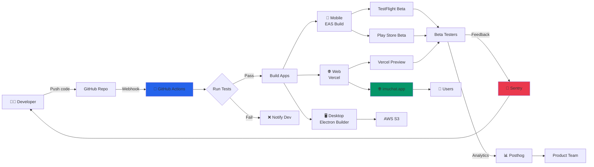

---

## 📊 Metrics Dashboard - KPIs

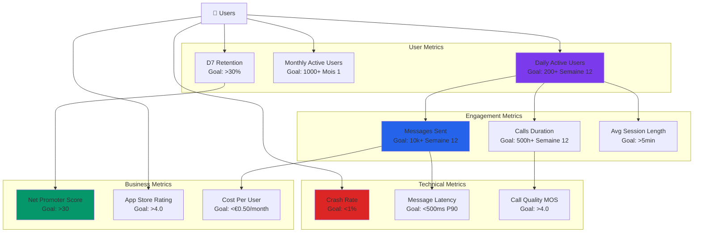

---

## 🔒 Security Architecture

```mermaid
graph TB
    subgraph "Client Side"
        MobileApp[📱 Mobile App]
        WebApp[🌐 Web App]
    end
    
    subgraph "Transport Layer"
        TLS[🔒 TLS 1.3 Encryption]
    end
    
    subgraph "Backend Security"
        RLS[🛡️ Row-Level Security<br/>Supabase PostgreSQL]
        JWT[🔑 JWT Tokens<br/>Supabase Auth]
        Storage[📦 Signed URLs<br/>Supabase Storage]
    end
    
    subgraph "Data Encryption"
        E2E[🔐 E2E Encryption<br/>Signal Protocol<br/>(Future v1.1)]
        AtRest[💾 Encryption at Rest<br/>AES-256<br/>PostgreSQL]
    end
    
    MobileApp -->|HTTPS| TLS
    WebApp -->|HTTPS| TLS
    
    TLS --> JWT
    JWT --> RLS
    
    RLS --> AtRest
    Storage --> AtRest
    
    MobileApp -.->|Future| E2E
    WebApp -.->|Future| E2E
    
    style TLS fill:#059669
    style RLS fill:#2563EB
    style JWT fill:#7C3AED
    style E2E fill:#DC2626
```

---

## 🎯 Conclusion Visuelle

### Priorités Architecture

1. **🔐 Security First** : TLS, RLS, JWT dès le début
2. **⚡ Real-time** : Supabase Realtime pour messages instantanés
3. **📹 High Quality Calls** : Stream SDK avec SFU architecture
4. **📱 Mobile-First** : Optimisation performance mobile prioritaire
5. **🌐 Multi-Platform** : Code sharing maximal (types, utils, components)

### Tech Choices Rationale

| Choix | Pourquoi |
|-------|----------|
| **Supabase** | Backend-as-a-Service complet, auth + DB + storage + realtime inclus |
| **Stream SDK** | Solution éprouvée pour calls, scalable, infrastructure gérée |
| **Expo** | Développement mobile rapide, hot reload, OTA updates |
| **Next.js** | SSR pour SEO, performance web, architecture moderne |
| **Electron** | Desktop cross-platform, partage code avec web |
| **TypeScript** | Type-safety, meilleure DX, moins de bugs runtime |

---

**Document créé** : 12 février 2026  
**Version** : 1.0  
**Format** : Mermaid diagrams (rendered in GitHub/VS Code)

---

*🎨 Une image vaut mille mots. Ces diagrammes sont la référence architecture.*
