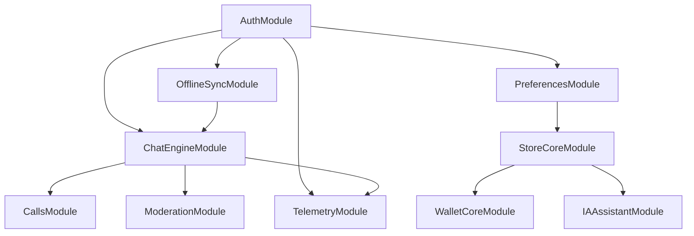

# 🚀 Phase C : Plan d'Action Détaillé

**Date de création :** 4 décembre 2025  
**Phase :** C - Fonctionnalités Avancées  
**Durée estimée :** 6 semaines (4 déc 2025 - 15 jan 2026)  
**Avancement actuel :** 25% (3/12 modules)

---

## 📊 État d'Avancement Phase B ✅

### Modules Complétés (7/7)

| Module | Lignes | Tests | Status |
|--------|--------|-------|--------|
| AuthModule | 613 | 42 ✅ | 100% |
| WebSocketModule | 592 | 27 ✅ | 100% |
| ContactsModule | 869 | 92 ✅ | 100% |
| NotificationsModule | 986 | 66 ✅ | 100% |
| PresenceModule | 1050 | 45 ✅ | 100% |
| MediaModule | 850 | 38 ✅ | 100% |
| SearchModule | 970 | 38 ✅ | 100% |

**Total :** ~6,930 lignes de code, 248 tests (100% passants)

### Refactoring Terminologique ✅

- ✅ GUILD → SERVER (66 occurrences)
- ✅ 0 occurrence de "guild" dans le code
- ✅ Documentation mise à jour (8 fichiers)
- ✅ UI mise à jour (3 fichiers)

---

## 🎯 Objectifs Phase C

### Modules à Implémenter (9 modules)

#### 🔴 Priorité P0 (Critique) - Semaine 9-10

1. **OfflineSyncModule** - Synchronisation offline
2. **ChatEngineModule** - Moteur de conversations unifié
3. **PreferencesModule** - Gestion des préférences utilisateur

#### 🟠 Priorité P1 (Haute) - Semaine 11-12

4. **CallsModule** - Appels audio/vidéo (base)
5. **ModerationModule** - Modération et sécurité
6. **StoreCoreModule** - Marketplace de modules

#### 🟡 Priorité P2 (Moyenne) - Semaine 13-14

7. **WalletCoreModule** - Portefeuille et paiements
8. **IAAssistantModule** - Assistant IA intégré
9. **TelemetryModule** - Analytics et monitoring

---

## 📅 Planning Détaillé

### Semaine 9-10 : Modules Critiques (4-15 décembre 2025)

#### 1️⃣ OfflineSyncModule

**Objectif :** Permettre l'utilisation hors ligne avec synchronisation automatique

**Fonctionnalités :**
- Queue de synchronisation avec priorités
- Détection de conflits (last-write-wins, merge strategies)
- Delta sync pour optimiser la bande passante
- Storage adapté par plateforme (IndexedDB/MMKV/File)
- Retry avec exponential backoff
- Événements sync (pending, syncing, synced, conflict)

**API Clés :**
```typescript
interface OfflineSyncModule {
  // Queue management
  queueOperation(operation: SyncOperation): Promise<string>;
  cancelOperation(operationId: string): Promise<void>;
  retryOperation(operationId: string): Promise<void>;
  
  // Sync control
  sync(): Promise<SyncResult>;
  pauseSync(): void;
  resumeSync(): void;
  
  // Conflict resolution
  resolveConflict(conflictId: string, resolution: ConflictResolution): Promise<void>;
  getConflicts(): Promise<Conflict[]>;
  
  // Status
  getSyncStatus(): SyncStatus;
  getQueuedOperations(): SyncOperation[];
}
```

**Tests estimés :** ~40 tests
- Queue avec priorités
- Détection de conflits
- Stratégies de résolution
- Retry logic
- Événements

**Durée :** 3-4 jours

---

#### 2️⃣ ChatEngineModule

**Objectif :** Moteur unifié pour gérer toutes les conversations

**Fonctionnalités :**
- Types de conversations (DM, GROUP, SERVER, CHANNEL)
- Gestion de l'historique avec pagination
- Indicateurs de typing
- Read receipts (accusés de lecture)
- Message threading (réponses)
- Pinned messages
- Draft messages (brouillons)
- Intégration avec PresenceModule

**API Clés :**
```typescript
interface ChatEngineModule {
  // Conversations
  getConversations(filters?: ConversationFilters): Promise<Conversation[]>;
  getConversation(conversationId: string): Promise<Conversation>;
  createConversation(data: CreateConversationData): Promise<Conversation>;
  deleteConversation(conversationId: string): Promise<void>;
  
  // Messages
  sendMessage(conversationId: string, content: MessageContent): Promise<Message>;
  editMessage(messageId: string, content: MessageContent): Promise<Message>;
  deleteMessage(messageId: string): Promise<void>;
  getMessages(conversationId: string, pagination: Pagination): Promise<Message[]>;
  
  // Interactions
  markAsRead(conversationId: string): Promise<void>;
  setTyping(conversationId: string, isTyping: boolean): Promise<void>;
  pinMessage(messageId: string): Promise<void>;
  unpinMessage(messageId: string): Promise<void>;
  
  // Drafts
  saveDraft(conversationId: string, draft: string): Promise<void>;
  getDraft(conversationId: string): Promise<string | null>;
}
```

**Tests estimés :** ~50 tests
- CRUD conversations
- CRUD messages
- Typing indicators
- Read receipts
- Threading
- Drafts
- Pagination

**Durée :** 4-5 jours

---

#### 3️⃣ PreferencesModule

**Objectif :** Gestion centralisée des préférences utilisateur

**Fonctionnalités :**
- Préférences par scope (global, per-conversation, per-server)
- Validation des préférences avec schemas
- Sync cross-device
- Import/Export des préférences
- Préférences par défaut
- Listeners de changements

**API Clés :**
```typescript
interface PreferencesModule {
  // Get/Set
  get<T>(key: string, scope?: PreferenceScope): Promise<T | undefined>;
  set<T>(key: string, value: T, scope?: PreferenceScope): Promise<void>;
  delete(key: string, scope?: PreferenceScope): Promise<void>;
  
  // Bulk operations
  getAll(scope?: PreferenceScope): Promise<Record<string, any>>;
  setMany(preferences: Record<string, any>, scope?: PreferenceScope): Promise<void>;
  reset(scope?: PreferenceScope): Promise<void>;
  
  // Import/Export
  export(): Promise<string>;
  import(data: string): Promise<void>;
  
  // Listeners
  onChange(key: string, callback: PreferenceChangeCallback): () => void;
}
```

**Tests estimés :** ~35 tests
- Get/Set/Delete
- Scopes (global, conversation, server)
- Bulk operations
- Import/Export
- Validation
- Change listeners

**Durée :** 2-3 jours

---

### Semaine 11-12 : Modules Haute Priorité (16-29 décembre 2025)

#### 4️⃣ CallsModule (Base)

**Objectif :** Appels audio/vidéo peer-to-peer

**Fonctionnalités :**
- Signaling avec WebSocket
- Audio calls (1-to-1 et groupe)
- Video calls avec HD
- Screen sharing
- Mute/Unmute audio/video
- Call quality indicators
- Call history
- Notification d'appel entrant

**API Clés :**
```typescript
interface CallsModule {
  // Call management
  initiateCall(userId: string, type: CallType): Promise<Call>;
  answerCall(callId: string): Promise<void>;
  rejectCall(callId: string): Promise<void>;
  endCall(callId: string): Promise<void>;
  
  // Media controls
  toggleAudio(): Promise<void>;
  toggleVideo(): Promise<void>;
  switchCamera(): Promise<void>;
  shareScreen(): Promise<void>;
  
  // Call info
  getActiveCall(): Call | null;
  getCallHistory(): Promise<CallRecord[]>;
  getCallQuality(): CallQuality;
}
```

**Tests estimés :** ~40 tests (signaling seulement, WebRTC mocké)

**Durée :** 4-5 jours

---

#### 5️⃣ ModerationModule

**Objectif :** Outils de modération et sécurité

**Fonctionnalités :**
- Report system (messages, users, servers)
- Auto-moderation (spam, liens, profanity)
- Ban/Kick/Mute users
- Warning system
- Moderation log
- Content filtering
- Permissions granulaires

**API Clés :**
```typescript
interface ModerationModule {
  // Reports
  reportContent(data: ReportData): Promise<Report>;
  getReports(filters?: ReportFilters): Promise<Report[]>;
  resolveReport(reportId: string, action: ModerationAction): Promise<void>;
  
  // User actions
  banUser(userId: string, reason: string, duration?: number): Promise<void>;
  kickUser(userId: string, serverId: string, reason: string): Promise<void>;
  muteUser(userId: string, duration: number): Promise<void>;
  warnUser(userId: string, reason: string): Promise<void>;
  
  // Auto-moderation
  configureAutoMod(config: AutoModConfig): Promise<void>;
  getFilteredWords(): Promise<string[]>;
  
  // Logs
  getModerationLog(filters?: LogFilters): Promise<ModerationLogEntry[]>;
}
```

**Tests estimés :** ~45 tests

**Durée :** 4-5 jours

---

#### 6️⃣ StoreCoreModule

**Objectif :** Marketplace de modules et extensions

**Fonctionnalités :**
- Catalogue de modules
- Installation/Désinstallation
- Mises à jour automatiques
- Permissions par module
- Reviews & ratings
- Catégories et tags
- Module dependencies
- Featured modules

**API Clés :**
```typescript
interface StoreCoreModule {
  // Catalog
  browseModules(filters?: ModuleFilters): Promise<StoreModule[]>;
  getModule(moduleId: string): Promise<StoreModule>;
  searchModules(query: string): Promise<StoreModule[]>;
  
  // Installation
  installModule(moduleId: string): Promise<void>;
  uninstallModule(moduleId: string): Promise<void>;
  updateModule(moduleId: string): Promise<void>;
  
  // User modules
  getInstalledModules(): Promise<InstalledModule[]>;
  enableModule(moduleId: string): Promise<void>;
  disableModule(moduleId: string): Promise<void>;
  
  // Reviews
  submitReview(moduleId: string, review: ModuleReview): Promise<void>;
  getReviews(moduleId: string): Promise<ModuleReview[]>;
}
```

**Tests estimés :** ~40 tests

**Durée :** 3-4 jours

---

### Semaine 13-14 : Modules Moyenne Priorité (30 déc - 15 jan 2026)

#### 7️⃣ WalletCoreModule

**Objectif :** Gestion du portefeuille et transactions

**Fonctionnalités :**
- Balance ImuCoins
- Transaction history
- Top-up (Stripe integration)
- P2P payments
- Rewards system
- Transaction receipts
- Spending analytics

**API Clés :**
```typescript
interface WalletCoreModule {
  // Balance
  getBalance(): Promise<WalletBalance>;
  topUp(amount: number, method: PaymentMethod): Promise<Transaction>;
  
  // Transactions
  sendPayment(userId: string, amount: number, memo?: string): Promise<Transaction>;
  getTransactions(filters?: TransactionFilters): Promise<Transaction[]>;
  getTransaction(transactionId: string): Promise<Transaction>;
  
  // Rewards
  claimReward(rewardId: string): Promise<void>;
  getAvailableRewards(): Promise<Reward[]>;
  
  // Analytics
  getSpendingStats(period: TimePeriod): Promise<SpendingStats>;
}
```

**Tests estimés :** ~35 tests

**Durée :** 3-4 jours

---

#### 8️⃣ IAAssistantModule

**Objectif :** Assistant IA conversationnel

**Fonctionnalités :**
- Chat avec IA (multiple personas)
- Smart replies suggestions
- Conversation summarization
- Language translation
- Content generation
- Context awareness
- Streaming responses

**API Clés :**
```typescript
interface IAAssistantModule {
  // Chat
  sendMessage(message: string, context?: ChatContext): Promise<IAResponse>;
  streamMessage(message: string, onChunk: (chunk: string) => void): Promise<void>;
  
  // Smart features
  getSuggestions(context: MessageContext): Promise<string[]>;
  summarizeConversation(conversationId: string): Promise<string>;
  translate(text: string, targetLanguage: string): Promise<string>;
  
  // Personas
  setPersona(persona: IAPersona): Promise<void>;
  getAvailablePersonas(): Promise<IAPersona[]>;
  
  // History
  getChatHistory(): Promise<IAMessage[]>;
  clearHistory(): Promise<void>;
}
```

**Tests estimés :** ~30 tests (IA calls mockés)

**Durée :** 3-4 jours

---

#### 9️⃣ TelemetryModule

**Objectif :** Analytics et monitoring

**Fonctionnalités :**
- Event tracking
- Performance metrics
- Error tracking
- User analytics
- Crash reports
- Custom metrics
- Privacy-focused (opt-in)

**API Clés :**
```typescript
interface TelemetryModule {
  // Events
  trackEvent(event: string, properties?: Record<string, any>): Promise<void>;
  trackPageView(page: string): Promise<void>;
  
  // Performance
  trackPerformance(metric: PerformanceMetric): Promise<void>;
  getPerformanceStats(): Promise<PerformanceStats>;
  
  // Errors
  trackError(error: Error, context?: ErrorContext): Promise<void>;
  getErrorStats(): Promise<ErrorStats>;
  
  // User
  setUserProperties(properties: Record<string, any>): Promise<void>;
  identifyUser(userId: string): Promise<void>;
  
  // Privacy
  optIn(): Promise<void>;
  optOut(): Promise<void>;
  getConsentStatus(): boolean;
}
```

**Tests estimés :** ~25 tests

**Durée :** 2-3 jours

---

## 📊 Métriques de Succès Phase C

### KPIs Techniques

| Métrique | Objectif |
|----------|----------|
| **Modules complétés** | 9/9 (100%) |
| **Tests unitaires** | ~380 tests |
| **Coverage** | > 50% |
| **Builds réussis** | 100% |
| **Modules interdépendants** | Fully integrated |

### KPIs Qualité

| Métrique | Objectif |
|----------|----------|
| **Documentation** | 100% des modules documentés |
| **Exemples** | 1 exemple par module |
| **TypeScript strict** | Aucune erreur |
| **ESLint** | Aucun warning |

---

## 🔄 Dépendances Entre Modules



**Ordre d'implémentation recommandé :**
1. PreferencesModule (aucune dépendance forte)
2. OfflineSyncModule (dépend Auth)
3. ChatEngineModule (dépend Auth, OfflineSync)
4. CallsModule (dépend Chat)
5. ModerationModule (dépend Chat)
6. StoreCoreModule (dépend Preferences)
7. WalletCoreModule (dépend Store)
8. IAAssistantModule (dépend Store)
9. TelemetryModule (en parallèle)

---

## 🎯 Actions Immédiates (Cette Semaine)

### Jour 1 (4 décembre)
- [x] ✅ Finaliser Phase B (SearchModule)
- [x] ✅ Refactoring GUILD→SERVER
- [x] ✅ Mise à jour documentation
- [ ] ⏳ Créer structure PreferencesModule

### Jour 2-3 (5-6 décembre)
- [ ] ⏳ Implémenter PreferencesModule
- [ ] ⏳ Tests PreferencesModule (35 tests)
- [ ] ⏳ Documentation + exemples

### Jour 4-5 (7-8 décembre)
- [ ] ⏳ Créer structure OfflineSyncModule
- [ ] ⏳ Implémenter queue system
- [ ] ⏳ Détection de conflits

---

## 📦 Livrables Phase C

### Fin Semaine 10 (15 décembre)
- ✅ OfflineSyncModule complet (40 tests)
- ✅ ChatEngineModule complet (50 tests)
- ✅ PreferencesModule complet (35 tests)
- ✅ Documentation modules

### Fin Semaine 12 (29 décembre)
- ✅ CallsModule complet (40 tests)
- ✅ ModerationModule complet (45 tests)
- ✅ StoreCoreModule complet (40 tests)
- ✅ Documentation modules

### Fin Semaine 14 (15 janvier)
- ✅ WalletCoreModule complet (35 tests)
- ✅ IAAssistantModule complet (30 tests)
- ✅ TelemetryModule complet (25 tests)
- ✅ Documentation complète Phase C
- ✅ ~630 tests totaux (248 Phase B + 380 Phase C)
- ✅ Coverage > 50%

---

## 🚀 Prochaines Étapes

1. **Aujourd'hui :** Commencer PreferencesModule
2. **Cette semaine :** Compléter 3 modules P0
3. **Semaine prochaine :** Démarrer modules P1
4. **Fin décembre :** 6/9 modules complétés
5. **Mi-janvier :** Phase C 100% complétée

---

*Document créé le 4 décembre 2025*  
*Prochaine révision : 15 décembre 2025*
