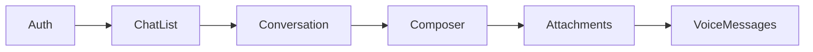
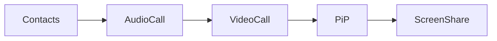

# 🗺️ ImuChat - Roadmap Unifiée Monorepo

**Date de création :** 2 décembre 2025  
**Version :** 1.1  
**Dernière mise à jour :** 2 décembre 2025  
**Objectif :** Feuille de route consolidée Web + Mobile + Desktop dans le monorepo

---

## 📊 État d'Avancement Global (Décembre 2025)

### Résumé Exécutif

| Plateforme | Phase Actuelle | Modules Core | Tests | Status |
|------------|----------------|--------------|-------|--------|
| **Web** | Phase 2 (50%) | 4/16 | 399 tests (7% coverage) | 🟡 En cours |
| **Mobile** | Phase 1.7 (80%) | 6/16 | Infrastructure prête | 🟢 Avancé |
| **Desktop** | Setup initial | 0/16 | À configurer | 🔴 À démarrer |
| **Monorepo** | Phase A (75%) | Packages partagés | ✅ Builds OK | 🟢 En cours |

### 📦 Packages Partagés - État Actuel

| Package | Version | Types/Composants | Build | Status |
|---------|---------|------------------|-------|--------|
| `@imuchat/shared-types` | 1.1.0 | 15 modules de types | ✅ | 🟢 Prêt |
| `@imuchat/ui-kit` | 1.0.0 | 19 composants, 7 thèmes | ✅ | 🟢 Prêt |
| `@imuchat/platform-core` | 1.0.0 | API + WebSocket | ⏳ | 🟡 En cours |

---

## 🏗️ Architecture Monorepo Consolidée

### Packages Partagés (Créés)

```
@imuchat/shared-types    → Types TypeScript communs (15 modules)
@imuchat/ui-kit          → Design System + 19 Composants + 7 Thèmes
@imuchat/platform-core   → Backend services + API
```

### Applications

```
@imuchat/web-app         → Next.js 16 (web)
@imuchat/mobile-app      → Expo 54 + React Native (iOS/Android)
@imuchat/desktop-app     → Electron 30 (macOS/Windows/Linux)
```

---

## 📱 Comparatif Fonctionnel Web vs Mobile

### Modules Core (16 modules requis)

| # | Module | Web | Mobile | Desktop | Priorité |
|---|--------|-----|--------|---------|----------|
| 1 | **Core Chat Engine** | ✅ | ✅ | ⏳ | P0 |
| 2 | **Auth & User Management** | ✅ | ✅ | ⏳ | P0 |
| 3 | **Contacts & Presence** | ✅ | ⏳ | ⏳ | P0 |
| 4 | **Notifications System** | ✅ | ⏳ | ⏳ | P0 |
| 5 | **Theme Engine** | ✅ Partiel | ✅ | ⏳ | P1 |
| 6 | **Store Core** | ✅ Partiel | ✅ | ⏳ | P1 |
| 7 | **Media Handler** | ⏳ | ✅ | ⏳ | P1 |
| 8 | **Calls & RTC** | ⏳ | ⏳ | ⏳ | P2 |
| 9 | **Wallet Core** | ✅ Partiel | ✅ | ⏳ | P1 |
| 10 | **Preferences** | ⏳ | ⏳ | ⏳ | P1 |
| 11 | **Search Core** | ⏳ | ⏳ | ⏳ | P2 |
| 12 | **Offline Sync** | ⏳ | ⏳ | ⏳ | P2 |
| 13 | **IA Assistant** | ⏳ | ⏳ | ⏳ | P2 |
| 14 | **Moderation & Safety** | ⏳ | ⏳ | ⏳ | P1 |
| 15 | **Telemetry** | ⏳ | ⏳ | ⏳ | P3 |
| 16 | **Localization i18n** | ✅ | ✅ | ⏳ | P0 |

**Légende :** ✅ Complet | ✅ Partiel | ⏳ À faire

### Fonctionnalités Avancées

| Fonctionnalité | Web | Mobile | Desktop | Notes |
|----------------|-----|--------|---------|-------|
| **Finance/Wallet** | ✅ UI | ✅ Complet | ⏳ | Mobile en avance |
| **Animations** | ⏳ Basiques | ✅ Complet | ⏳ | reanimated + gestures |
| **Storybook** | ⏳ | ✅ | ⏳ | Mobile prêt |
| **WebSocket** | ✅ | ⏳ | ⏳ | Web en avance |
| **PWA** | ⏳ | N/A | N/A | - |
| **Push Notifications** | ✅ FCM | ⏳ | ⏳ | - |

---

## 🎯 Roadmap Unifiée 2025-2026

### Phase A : Consolidation Monorepo (Décembre 2025)
*Durée : 2 semaines | Priorité : CRITIQUE*

#### Semaine 1-2 : Migration & Synchronisation

- [x] **Synchronisation types** ✅ COMPLÉTÉ
  - [x] Merger types web + mobile dans shared-types
  - [x] Validation TypeScript cross-platform
  - [x] Export schemas Zod partagés
  - [x] Ajout types: wallet, theme, notification, contact, i18n

- [x] **Configuration workspace** ✅ COMPLÉTÉ
  - [x] Correction ImuChat.code-workspace (suppression doublons)
  - [x] pnpm workspace fonctionnel

- [x] **UI Kit** ✅ 19 COMPOSANTS
  - [x] Button, IconButton
  - [x] Card, Modal, Dialog
  - [x] Input, Label, Checkbox, Switch, Select
  - [x] Avatar, Badge, Text
  - [x] Tabs, DropdownMenu
  - [x] Tooltip, Popover
  - [x] Spinner, Skeleton

- [x] **Design Tokens** ✅ COMPLÉTÉ
  - [x] Couleurs (primary, secondary, success, error, etc.)
  - [x] Typographie (fonts, sizes, weights)
  - [x] Espacement (spacing, spacingNumeric)
  - [x] Ombres (shadows, shadowsNative)
  - [x] Animations (durations, easings)

- [x] **Thèmes** ✅ 7 THÈMES
  - [x] Light (défaut)
  - [x] Dark
  - [x] Sakura Pink
  - [x] Cyber Neon (premium)
  - [x] Zen Green
  - [x] Midnight Purple
  - [x] Ocean Blue

- [ ] **À faire cette semaine**
  - [ ] Adapter composants pour React Native (nativewind)
  - [ ] Tests unitaires partagés
  - [ ] Build scripts CI/CD

#### Livrables Semaine 2
- ✅ Workspace pnpm fonctionnel
- 📦 ui-kit avec 15+ composants partagés
- 📦 shared-types complets
- 🔧 Scripts build automatisés

---

### Phase B : Modules Core Partagés (Janvier 2026)
*Durée : 4 semaines | Priorité : HAUTE*

#### Semaine 3-4 : Infrastructure Modules

| Module | Tâches | Owner |
|--------|--------|-------|
| **Auth** | Unifier Firebase Auth web/mobile | shared |
| **WebSocket** | Service partagé Socket.IO | platform-core |
| **Event Bus** | Centraliser dans platform-core | shared |
| **Module Registry** | Interface commune | shared |

#### Semaine 5-6 : Modules Communication

| Module | Tâches | Owner |
|--------|--------|-------|
| **Contacts** | Migrer depuis web vers shared | web → shared |
| **Notifications** | Adapter FCM pour mobile | shared |
| **Chat Engine** | Types et hooks partagés | shared |
| **Presence** | Service temps réel unifié | platform-core |

#### Livrables Phase B
- 8/16 modules core fonctionnels sur toutes plateformes
- Coverage tests > 30%
- Documentation API modules

---

### Phase C : Fonctionnalités Avancées (Février-Mars 2026)
*Durée : 6 semaines | Priorité : HAUTE*

#### Semaine 7-9 : Modules Métier

| Module | Web | Mobile | Desktop |
|--------|-----|--------|---------|
| **Media Handler** | Upload/Preview | Camera + Gallery | Drag & Drop |
| **Search Core** | Recherche globale | In-app search | Global search |
| **Offline Sync** | IndexedDB | MMKV + SQLite | File system |
| **Calls (basic)** | WebRTC signaling | Native calls | WebRTC |

#### Semaine 10-12 : Expérience Utilisateur

| Module | Web | Mobile | Desktop |
|--------|-----|--------|---------|
| **Wallet Core** | Stripe + ImuCoin | Apple/Google Pay | Stripe |
| **IA Assistant** | Genkit flows | Mobile adaptation | Full features |
| **Moderation** | Report + Filter | Same | Same |
| **Telemetry** | Analytics | Crashlytics | Sentry |

#### Livrables Phase C
- 16/16 modules core complets
- Coverage tests > 50%
- Beta releases toutes plateformes

---

### Phase D : Design Kawaii UI/UX (Avril-Juillet 2026)
*Durée : 16 semaines | Priorité : HAUTE*

> Référence : [KAWAII_UI_UX_DESIGN_CHARTER.md](../web-app/docs/KAWAII_UI_UX_DESIGN_CHARTER.md)

#### Thèmes & Branding
- 7 palettes officielles (Sakura, Dream Lavender, etc.)
- Mascotte Imu-chan (5 états Lottie)
- Sound Design (6 sons événements)
- Animations kawaii cross-platform

#### Composants Kawaii
- KawaiiButton, KawaiiCard, KawaiiInput
- KawaiiAvatar, KawaiiModal, KawaiiTooltip
- Système de rewards visuels
- Modes spéciaux (Dream, Relax, Saisonnier)

---

### Phase E : Production & Launch (Août-Octobre 2026)
*Durée : 12 semaines | Priorité : CRITIQUE*

#### Optimisations Performance
- Bundle size < 250KB (web)
- Cold start < 3s (mobile)
- Memory optimization (desktop)
- Lighthouse score > 90

#### Audits & Compliance
- Security audit complet
- WCAG 2.1 AA accessibility
- RGPD compliance
- App Store / Play Store guidelines

#### Déploiements
- Firebase Hosting (web)
- TestFlight + Play Store (mobile)
- Mac App Store + Windows Store (desktop)

---

## 📊 Métriques de Succès

### KPIs Techniques

| Métrique | Actuel | Objectif Q1 2026 | Objectif Launch |
|----------|--------|------------------|-----------------|
| **Coverage Tests** | 7% | 50% | 80% |
| **Bundle Size Web** | N/A | < 500KB | < 250KB |
| **Cold Start Mobile** | ~4s | < 3s | < 2s |
| **Lighthouse Score** | N/A | > 80 | > 95 |
| **Crash-free Rate** | N/A | > 98% | > 99.5% |

### KPIs Produit

| Métrique | Objectif Beta | Objectif Launch |
|----------|---------------|-----------------|
| **DAU** | 100 | 10,000 |
| **Retention D7** | 30% | 50% |
| **Retention D30** | 15% | 30% |
| **NPS Score** | 40 | 70 |
| **Session Duration** | 5min | 15min |

---

## 🛠️ Stack Technique Unifiée

### Frontend Partagé
```
TypeScript 5.x     → Tous les packages
React 18+          → web-app, desktop-app
React Native 0.81  → mobile-app
Tailwind CSS       → web-app, ui-kit (nativewind pour mobile)
Zustand            → State management
React Query        → Data fetching
```

### Backend
```
platform-core/
├── Fastify        → API REST
├── Drizzle ORM    → Database (PostgreSQL)
├── Socket.IO      → WebSocket
├── Firebase       → Auth + Storage + FCM
└── Genkit         → IA (Google AI)
```

### Build & Deploy
```
pnpm workspaces    → Monorepo management
tsup               → Library builds
Next.js            → Web SSR/SSG
Expo EAS           → Mobile builds
Electron Builder   → Desktop builds
GitHub Actions     → CI/CD
```

---

## 📅 Calendrier Récapitulatif

| Phase | Durée | Période | Priorité | Status |
|-------|-------|---------|----------|--------|
| **A - Consolidation** | 2 sem | Déc 2025 | CRITIQUE | 🟡 En cours |
| **B - Modules Core** | 4 sem | Jan 2026 | HAUTE | ⏳ Planifié |
| **C - Features Avancées** | 6 sem | Fév-Mars 2026 | HAUTE | ⏳ Planifié |
| **D - Design Kawaii** | 16 sem | Avr-Juil 2026 | HAUTE | ⏳ Planifié |
| **E - Production** | 12 sem | Août-Oct 2026 | CRITIQUE | ⏳ Planifié |

**Total estimé :** 40 semaines (~10 mois)  
**Launch prévu :** Octobre 2026

---

## 🎯 Actions Immédiates (Cette Semaine)

### Priorité 1 : Finaliser migration packages partagés
1. ✅ Configurer pnpm workspace
2. ⏳ Migrer composants UI depuis ImuChat → ui-kit
3. ⏳ Unifier types dans shared-types
4. ⏳ Tester builds cross-platform

### Priorité 2 : Synchroniser modules existants
1. ⏳ Migrer Module Contacts (web) vers shared
2. ⏳ Migrer Module Notifications (web) vers shared
3. ⏳ Adapter services platform-core

### Priorité 3 : Documentation
1. ⏳ Guide développeur monorepo
2. ⏳ API documentation modules
3. ⏳ Contributing guidelines

---

---

## 🎯 50 Fonctionnalités ImuChat - Matrice d'Implémentation

> Référence : [FUNCTIONNALYTIES_LIST.md](./FUNCTIONNALYTIES_LIST.md)

### Vue d'ensemble par groupe

| Groupe | Nom | Nb Features | Priorité | Phase |
|--------|-----|-------------|----------|-------|
| 1 | Messagerie & Communication | 5 | 🔴 P0 | A-B |
| 2 | Appels audio & vidéo | 5 | 🔴 P0 | B-C |
| 3 | Profils & Identité | 5 | 🟠 P1 | B |
| 4 | Personnalisation avancée | 5 | 🟠 P1 | C-D |
| 5 | Mini-apps sociales | 5 | 🟠 P1 | C |
| 6 | Modules avancés | 5 | 🟡 P2 | C-D |
| 7 | Services utilitaires publics | 5 | 🟡 P2 | D |
| 8 | Divertissement & Création | 5 | 🟡 P2 | D |
| 9 | IA intégrée | 5 | 🟠 P1 | C-D |
| 10 | App Store & Écosystème | 5 | 🟠 P1 | D-E |

### Détail Groupe 1 : Messagerie & Communication

| # | Fonctionnalité | Web | Mobile | Desktop | Écrans requis |
|---|----------------|-----|--------|---------|---------------|
| 1.1 | Messagerie instantanée (texte, emojis, GIFs) | ✅ | ✅ | ⏳ | ChatList, Conversation |
| 1.2 | Messages vocaux transcrits automatiquement | ⏳ | ⏳ | ⏳ | VoiceRecorder, Transcription |
| 1.3 | Pièces jointes (photos, vidéos, fichiers) | ✅ | ⏳ | ⏳ | AttachmentPicker, Preview |
| 1.4 | Édition et suppression des messages | ✅ | ⏳ | ⏳ | MessageOptions |
| 1.5 | Réactions rapides aux messages | ⏳ | ⏳ | ⏳ | ReactionPicker |

### Détail Groupe 2 : Appels audio & vidéo

| # | Fonctionnalité | Web | Mobile | Desktop | Écrans requis |
|---|----------------|-----|--------|---------|---------------|
| 2.1 | Appels audio (1-to-1 ou groupe) | ⏳ | ⏳ | ⏳ | AudioCall |
| 2.2 | Appels vidéo HD avec réduction du bruit | ⏳ | ⏳ | ⏳ | VideoCall |
| 2.3 | Mini-fenêtre flottante (PiP) | ⏳ | ⏳ | ⏳ | PiPOverlay |
| 2.4 | Partage d'écran (mobile & desktop) | ⏳ | ⏳ | ⏳ | ScreenShare |
| 2.5 | Filtre beauté IA + flou d'arrière-plan | ⏳ | ⏳ | ⏳ | IAFilterModal |

### Détail Groupe 3 : Profils & Identité

| # | Fonctionnalité | Web | Mobile | Desktop | Écrans requis |
|---|----------------|-----|--------|---------|---------------|
| 3.1 | Profils privés, publics et anonymes | ⏳ | ⏳ | ⏳ | ProfileView |
| 3.2 | Multi-profils (perso, pro, créateur) | ⏳ | ⏳ | ⏳ | MultiProfileSwitcher |
| 3.3 | Avatars 2D/3D personnalisables | ⏳ | ⏳ | ⏳ | AvatarEditor |
| 3.4 | Statuts animés (emoji, texte, musique) | ⏳ | ⏳ | ⏳ | StatusEditor |
| 3.5 | Vérification d'identité volontaire | ⏳ | ⏳ | ⏳ | Verification |

### Détail Groupe 4 : Personnalisation avancée

| # | Fonctionnalité | Web | Mobile | Desktop | Écrans requis |
|---|----------------|-----|--------|---------|---------------|
| 4.1 | Thèmes visuels (Kawaii, Pro, Night...) | ✅ Partiel | ✅ | ⏳ | ThemePicker |
| 4.2 | Arrière-plans animés pour les chats | ⏳ | ⏳ | ⏳ | WallpaperPicker |
| 4.3 | Police personnalisable par conversation | ⏳ | ⏳ | ⏳ | FontSettings |
| 4.4 | Packs d'icônes et de sons | ⏳ | ⏳ | ⏳ | IconPackStore |
| 4.5 | Widget homescreen | N/A | ⏳ | ⏳ | Widget |

### Détail Groupe 5 : Mini-apps sociales natives

| # | Fonctionnalité | Web | Mobile | Desktop | Écrans requis |
|---|----------------|-----|--------|---------|---------------|
| 5.1 | Stories 24h | ⏳ | ⏳ | ⏳ | Stories, StoryViewer |
| 5.2 | Mur social type "timeline" | ⏳ | ⏳ | ⏳ | Timeline, PostDetail |
| 5.3 | Mini-blogs personnels | ⏳ | ⏳ | ⏳ | BlogEditor |
| 5.4 | Événements (invites, inscriptions) | ⏳ | ⏳ | ⏳ | EventsCalendar |
| 5.5 | Groupes publics/privés avec feed | ⏳ | ⏳ | ⏳ | GroupFeed, GroupMembers |

### Détail Groupe 6 : Modules avancés

| # | Fonctionnalité | Web | Mobile | Desktop | Écrans requis |
|---|----------------|-----|--------|---------|---------------|
| 6.1 | Productivity Hub (tâches, planning) | ⏳ | ⏳ | ⏳ | TaskList, Kanban |
| 6.2 | Suite Office (texte, tableur, slides) | ⏳ | ⏳ | ⏳ | DocsEditor |
| 6.3 | Module PDF complet | ⏳ | ⏳ | ⏳ | PDFViewer |
| 6.4 | Board collaboratif (whiteboard, mindmap) | ⏳ | ⏳ | ⏳ | BoardCanvas |
| 6.5 | Cooking & Home (courses, ménage, repas) | ⏳ | ⏳ | ⏳ | HomeManager |

### Détail Groupe 7 : Services utilitaires publics

| # | Fonctionnalité | Web | Mobile | Desktop | Écrans requis |
|---|----------------|-----|--------|---------|---------------|
| 7.1 | Horaires métro/tram/bus avec alertes | ⏳ | ⏳ | ⏳ | TransportSearch |
| 7.2 | Info trafic routier en temps réel | ⏳ | ⏳ | ⏳ | TrafficMap |
| 7.3 | Numéros d'urgence géolocalisés | ⏳ | ⏳ | ⏳ | EmergencyNumbers |
| 7.4 | Annuaire des services publics | ⏳ | ⏳ | ⏳ | ServicesDirectory |
| 7.5 | Suivi colis multi-transporteurs | ⏳ | ⏳ | ⏳ | ParcelTracking |

### Détail Groupe 8 : Divertissement & Création

| # | Fonctionnalité | Web | Mobile | Desktop | Écrans requis |
|---|----------------|-----|--------|---------|---------------|
| 8.1 | Mini-lecteur musique + playlists | ⏳ | ⏳ | ⏳ | MusicPlayer, DockPlayer |
| 8.2 | Podcasts (catalogue + favoris) | ⏳ | ⏳ | ⏳ | Podcasts |
| 8.3 | Lecteur vidéo intégré | ⏳ | ⏳ | ⏳ | VideoPlayer |
| 8.4 | Mini-jeux sociaux | ⏳ | ⏳ | ⏳ | MiniGames |
| 8.5 | Outil de création stickers & emojis | ⏳ | ⏳ | ⏳ | StickerCreator |

### Détail Groupe 9 : IA intégrée

| # | Fonctionnalité | Web | Mobile | Desktop | Écrans requis |
|---|----------------|-----|--------|---------|---------------|
| 9.1 | Chatbot multi-personas | ⏳ | ⏳ | ⏳ | ChatbotModal |
| 9.2 | Suggestions intelligentes de réponses | ⏳ | ⏳ | ⏳ | SmartReplyBar |
| 9.3 | Résumé automatisé des conversations | ⏳ | ⏳ | ⏳ | ConversationSummary |
| 9.4 | Modération automatique groupes | ⏳ | ⏳ | ⏳ | ModerationPanel |
| 9.5 | Traduction instantanée dans les chats | ⏳ | ⏳ | ⏳ | TranslationOverlay |

### Détail Groupe 10 : App Store & Écosystème

| # | Fonctionnalité | Web | Mobile | Desktop | Écrans requis |
|---|----------------|-----|--------|---------|---------------|
| 10.1 | Store d'apps internes & partenaires | ✅ Partiel | ✅ | ⏳ | StoreHome, AppDetail |
| 10.2 | Installation/désinstallation modules | ⏳ | ⏳ | ⏳ | InstallFlow |
| 10.3 | Système de permissions par app | ⏳ | ⏳ | ⏳ | Permissions |
| 10.4 | Marketplace de services | ⏳ | ⏳ | ⏳ | Marketplace |
| 10.5 | Paiement intégré + portefeuille | ✅ UI | ✅ | ⏳ | WalletHome, Checkout |

---

## 🗺️ Sitemap Cross-Platform

> Référence : [Sitemap_web_complet.md](../web-app/Sitemap_web_complet.md)

### Routes Web (Next.js)

```
/                     → Landing page
├── /features         → Liste fonctionnalités
├── /pricing          → Plans & tarifs
├── /about            → À propos
├── /blog             → Blog articles
├── /business         → Comptes officiels, API
├── /careers          → Emplois
├── /support          → Centre d'aide
├── /contact          → Contact
└── /legal/*          → Privacy, Terms

/login                → Connexion
/signup               → Inscription
/onboarding           → Setup initial
/verify               → Vérification identité

/dashboard            → Accueil utilisateur (post-login)
├── /chats            → Liste conversations
│   └── /chats/:id    → Conversation
├── /calls            → Historique appels
├── /social           → Social hub
│   ├── /stories      → Stories
│   ├── /timeline     → Feed
│   ├── /groups/:id   → Groupe détail
│   └── /events       → Événements
├── /modules/*        → Modules installés
├── /services         → Services publics
├── /media            → Media hub
├── /ai               → IA assistant
├── /store/:app       → Store apps
├── /wallet           → Portefeuille
├── /profile          → Profil utilisateur
└── /settings         → Paramètres

/ads                  → Gestion pubs (annonceurs)
/partners             → Portal partenaires
/admin                → Dashboard admin
```

### Écrans Mobile (React Native/Expo)

```
[Bottom Tab Bar]
├── ChatsTab          → ChatList → Conversation → CallScreen
├── SocialTab         → Stories → Timeline → Groups
├── ModulesTab        → ModulesHome → ModuleDetail
├── MediaTab          → MusicPlayer → Podcasts → Games
└── StoreTab          → StoreHome → AppDetail → InstallFlow

[Drawer]
├── Profile           → ProfileView → AvatarEditor
├── Personalization   → ThemePicker → WallpaperPicker
├── Settings          → AccountSettings → Privacy
└── Support           → Help → Contact

[Overlays & Modals]
├── CallOverlay       → AudioCall / VideoCall → PiP
├── AIOverlay         → ChatbotModal → SmartReply
├── PaymentModal      → Checkout → TopUp
└── AttachmentPicker  → Camera → Gallery → Files
```

### Deep Links

| Pattern | Destination |
|---------|-------------|
| `imuchat://chat/:id` | Conversation spécifique |
| `imuchat://story/:id` | Story viewer |
| `imuchat://user/:id` | Profil utilisateur |
| `imuchat://app/:id` | App du store |
| `imuchat://call/:id` | Rejoindre appel |

---

## 📐 Ordre d'Implémentation Détaillé

### Sprint 1-2 : Core Communication (Phase A)



**Écrans à créer :**
1. `AuthScreen` (Login/Signup)
2. `OnboardingFlow` 
3. `ChatList` (conversations)
4. `Conversation` (messages)
5. `MessageComposer` (input)
6. `AttachmentPicker`
7. `VoiceRecorder`

### Sprint 3-4 : Appels & Présence (Phase B)



**Écrans à créer :**
1. `ContactsList`
2. `AudioCallScreen`
3. `VideoCallScreen`
4. `PiPOverlay`
5. `ScreenShareFlow`

### Sprint 5-6 : Profil & Personnalisation (Phase B)

**Écrans à créer :**
1. `ProfileView`
2. `MultiProfileSwitcher`
3. `AvatarEditor`
4. `StatusEditor`
5. `ThemePicker`
6. `WallpaperPicker`

### Sprint 7-8 : Social Features (Phase C)

**Écrans à créer :**
1. `Stories` + `StoryViewer`
2. `Timeline` + `PostDetail`
3. `GroupFeed` + `GroupMembers`
4. `EventsCalendar`

### Sprint 9-12 : Modules & Services (Phase C-D)

**Écrans à créer :**
1. `ProductivityHub`
2. `PDFViewer`
3. `BoardCanvas`
4. `TransportSearch`
5. `ParcelTracking`

### Sprint 13-16 : Media & IA (Phase D)

**Écrans à créer :**
1. `MusicPlayer` (dockable)
2. `Podcasts`
3. `MiniGames`
4. `StickerCreator`
5. `ChatbotModal`
6. `TranslationOverlay`

### Sprint 17-20 : Store & Monetization (Phase E)

**Écrans à créer :**
1. `StoreHome`
2. `AppDetail`
3. `InstallFlow`
4. `WalletHome`
5. `Checkout`
6. `Marketplace`

---

## 📚 Documents de Référence

- **Web Roadmap :** [web-roadmap.md](../web-app/docs/web-roadmap.md)
- **Mobile Roadmap :** [ROADMAP.md](../mobile-app/ROADMAP.md)
- **Mobile Wireflow :** [wireflow_visuel.md](../mobile-app/wireflow_visuel.md)
- **Core Modules Spec :** [CORE_MODULES.md](../web-app/docs/CORE_MODULES.md)
- **50 Fonctionnalités :** [FUNCTIONNALYTIES_LIST.md](./FUNCTIONNALYTIES_LIST.md)
- **Sitemap Complet :** [Sitemap_web_complet.md](../web-app/Sitemap_web_complet.md)
- **Kawaii Design :** [KAWAII_UI_UX_DESIGN_CHARTER.md](../web-app/docs/KAWAII_UI_UX_DESIGN_CHARTER.md)
- **Gap Analysis :** [GAP_ANALYSIS.md](./GAP_ANALYSIS.md)

---

*Document généré le 2 décembre 2025*  
*Mise à jour : Intégration 50 fonctionnalités + Sitemap*  
*Prochaine révision : 16 décembre 2025*
