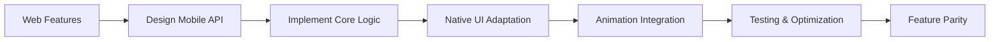

# 📊 Analyse Comparative Mobile vs Web - ImuChat

## 🎯 Vue d'Ensemble

Cette analyse compare l'état actuel des versions mobile et web d'ImuChat pour établir une stratégie de synchronisation et de développement coordonnée.

---

## 🏗️ Architecture Comparative

### 📱 Version Mobile (React Native / Expo)

```
📁 Structure Appli mobile:
├── app/                    # Expo Router (App Router)
│   ├── (tabs)/            # Navigation par onglets
│   │   ├── index.tsx      # Accueil
│   │   ├── profile.tsx    # Profil ✅ Animations
│   │   ├── watch.tsx      # Watch/Vidéos
│   │   ├── store.tsx      # Boutique
│   │   └── comms.tsx      # Communications
│   ├── chat/              # Système de chat
│   ├── settings.tsx       # Paramètres ✅ Animations
│   └── _layout.tsx        # Layout principal
├── src/
│   ├── components/        # Composants réutilisables
│   │   └── animations/    # ✅ Système d'animations complet
│   └── styles/           # Styles globaux
└── ROADMAP.md            # Planification du développement
```

**État du Développement:** 🟡 **En Développement Actif**

- ÉTAPE 1.4 ✅ Animations complètes (6 composants)
- Structure de base fonctionnelle
- Navigation par onglets opérationnelle
- Système de chat basique

### 🌐 Version Web (Next.js)

```
📁 Structure Avancée:
├── src/
│   ├── app/              # Next.js App Router
│   ├── components/       # 43+ composants UI sophistiqués
│   ├── modules/          # 🚀 32 modules fonctionnels
│   │   ├── admin/        # Administration
│   │   ├── chat/         # Chat avancé
│   │   ├── dating/       # Rencontres
│   │   ├── events/       # Événements
│   │   ├── finance/      # Finance/Portefeuille
│   │   ├── games/        # Jeux
│   │   ├── music/        # Musique
│   │   ├── news/         # Actualités
│   │   ├── podcasts/     # Podcasts
│   │   ├── sports/       # Sports
│   │   ├── wallet/       # Portefeuille crypto
│   │   └── ... (20+ autres)
│   ├── services/         # 10+ services backend
│   ├── ai/              # 🤖 Intégration IA (Genkit)
│   ├── contexts/        # Gestion d'état globale
│   └── lib/             # Utilitaires et configurations
├── public/              # Assets statiques
└── docs/                # Documentation complète

```

**État du Développement:** 🟢 **Production Ready**

- Écosystème complet avec 32 modules
- Intégration IA avancée
- Backend Firebase complet
- Système d'internationalisation
- Architecture modulaire mature

---

## 🔧 Technologies Utilisées

### 📱 Stack Mobile

| Catégorie | Technologie | Version | État |
|-----------|-------------|---------|------|
| **Framework** | React Native + Expo | Latest | ✅ Stable |
| **Navigation** | Expo Router | Latest | ✅ Opérationnel |
| **Animations** | react-native-animatable | 1.4.0 | ✅ Intégré |

| **Gestures** | react-native-gesture-handler | Latest | ✅ Configuré |
| **Storage** | AsyncStorage | Latest | ✅ Migré |
| **State** | React Context | Built-in | 🟡 Basique |

### 🌐 Stack Web

| Catégorie | Technologie | Version | État |
|-----------|-------------|---------|------|
| **Framework** | Next.js | 15.3.3 | ✅ Production |
| **UI Library** | Radix UI | Latest | ✅ Complet |
| **Animations** | Framer Motion | Latest | ✅ Avancé |
| **Backend** | Firebase | 10+ | ✅ Intégré |
| **IA** | Google Genkit | Latest | ✅ Fonctionnel |
| **i18n** | next-intl | Latest | ✅ Multi-langues |
| **State** | Zustand + Context | Latest | ✅ Sophistiqué |

---

## 📊 Comparaison des Fonctionnalités

### 🟢 Fonctionnalités Communes

- ✅ Système de profil utilisateur
- ✅ Chat de base

- ✅ Navigation intuitive
- ✅ Paramètres utilisateur
- ✅ Interface moderne

### 🔴 Écart de Fonctionnalités

#### 🌐 Exclusives Web (À Implémenter Mobile)

| Module | Description | Priorité | Complexité |
|--------|-------------|----------|------------|
| **🤖 IA** | Intégration Genkit, assistants | 🔥 Haute | 🔴 Élevée |
| **💰 Finance** | Portefeuille crypto, transactions | 🔥 Haute | 🔴 Élevée |
| **🎮 Gaming** | Jeux intégrés, tournois | 🟡 Moyenne | 🟡 Moyenne |
| **📺 Streaming** | Podcasts, musique, vidéos | 🔥 Haute | 🟡 Moyenne |

| **📰 News** | Actualités personnalisées | 🟡 Moyenne | 🟢 Faible |
| **🏃 Sports** | Suivi sportif, paris | 🟡 Moyenne | 🟡 Moyenne |
| **💕 Dating** | Système de rencontres | 🟡 Moyenne | 🔴 Élevée |
| **🎉 Events** | Gestion d'événements | 🟡 Moyenne | 🟡 Moyenne |
| **🛍️ Marketplace** | E-commerce avancé | 🔥 Haute | 🟡 Moyenne |
| **🌍 Worlds** | Métavers/mondes virtuels | 🟡 Faible | 🔴 Très Élevée |

#### 📱 Avantages Mobile

- ✅ Animations 60fps optimisées
- ✅ Gestures natives avancées

- ✅ Performance native
- ✅ Notifications push (à venir)
- ✅ Caméra/microphone natifs

---

## 🎨 Système d'Animations

### 📱 Mobile - Système Complet

```typescript
// Composants d'animation créés
✅ AnimatedView      - Animations d'entrée/sortie
✅ AnimatedButton    - Micro-interactions
✅ LoadingAnimation  - États de chargement
✅ Swipeable        - Gestures de swipe

✅ PageTransition   - Transitions entre écrans
✅ AnimatedScreen   - Wrapper d'écran

// Performance
- 60fps avec useNativeDriver
- Gestures fluides
- Transitions contextuelles
```

### 🌐 Web - Framer Motion

```typescript
// Système mature avec Framer Motion

- Animations complexes CSS
- Transitions de page sophistiquées
- Animations basées sur scroll
- Micro-interactions avancées
```

---

## 🔄 Stratégie de Synchronisation

### 🎯 Phase 1: Harmonisation de l'Architecture (1-2 semaines)

1. **Standardisation des Modules**
   - Créer une structure modulaire mobile similaire au web
   - Implémenter les services de base (analytics, eventBus, etc.)
   - Établir une couche d'abstraction commune

2. **Système de State Management**
   - Migrer vers Zustand pour la cohérence
   - Implémenter les contexts partagés
   - Synchroniser les interfaces utilisateur

### 🎯 Phase 2: Implémentation des Modules Critiques (3-4 semaines)

1. **Module Finance/Wallet** 🔥
   - API de crypto-monnaies
   - Gestion des transactions

   - Interface de portefeuille

2. **Module IA** 🔥
   - Adaptation de Genkit pour mobile
   - Assistants conversationnels
   - Recommandations personnalisées

3. **Module Streaming** 🔥
   - Lecteur audio/vidéo natif
   - Système de podcasts
   - Intégration musicale

### 🎯 Phase 3: Modules Secondaires (4-6 semaines)

1. **Gaming & Entertainment**
   - Jeux simples adaptés mobile

   - Système de points/récompenses
   - Intégration sociale

2. **News & Content**
   - Flux d'actualités
   - Personnalisation de contenu
   - Système de bookmarks

3. **E-commerce & Marketplace**
   - Boutique intégrée
   - Gestion des commandes
   - Système de paiement

### 🎯 Phase 4: Modules Avancés (6-8 semaines)

1. **Dating & Social**
   - Système de matching
   - Géolocalisation
   - Profils étendus

2. **Events & Sports**
   - Calendrier d'événements
   - Suivi sportif
   - Intégrations tierces

---

## 🔧 Méthodologie de Développement

### 🔄 Approche de Synchronisation



### 📋 Checklist par Module

Pour chaque nouveau module mobile:

- [ ] Analyser l'équivalent web

- [ ] Concevoir l'adaptation mobile
- [ ] Implémenter la logique métier
- [ ] Créer l'interface native
- [ ] Intégrer les animations
- [ ] Tests de performance
- [ ] Documentation

### 🧪 Stratégie de Test

1. **Tests Unitaires**: Jest + React Native Testing Library
2. **Tests d'Intégration**: Detox pour E2E
3. **Tests de Performance**: 60fps validation
4. **Tests Cross-Platform**: Comparaison comportementale

---

## 📈 Métriques de Succès

### 🎯 Objectifs Quantifiables

- **Feature Parity**: 80% des fonctionnalités web portées mobile
- **Performance**: Maintenir 60fps sur toutes les animations
- **Bundle Size**: <50MB pour l'app mobile complète

- **Loading Time**: <3s pour le démarrage à froid
- **User Retention**: Comparable entre web et mobile

### 📊 KPIs de Synchronisation

- Nombre de modules portés par sprint
- Temps de développement par module
- Taux de bugs cross-platform
- Satisfaction utilisateur (NPS)

---

## 🚀 Prochaines Étapes Immédiates

### 📱 Mobile (Cette Semaine)

1. ✅ **ÉTAPE 1.4 Complète** - Animations finalisées
2. 🔄 **ÉTAPE 1.5** - Architecture modulaire
3. 🔄 **ÉTAPE 1.6** - State management (Zustand)
4. 🔄 **ÉTAPE 1.7** - Module Finance (base)

### 📋 Actions Prioritaires

1. **Refactoring Architecture**
   - Créer `/src/modules/` mobile
   - Implémenter les services de base

   - Migrer vers Zustand

2. **Module Finance** (Priorité 1)
   - API crypto-monnaies
   - Interface portefeuille
   - Système de transactions

3. **Module IA** (Priorité 2)
   - Adaptation Genkit mobile
   - Chat assisté
   - Recommandations

---

## 💡 Recommandations Stratégiques

### 🎯 Approche Recommandée

1. **Développement Incrémental**: Portage module par module
2. **Réutilisation de Code**: Logique métier partagée via API
3. **UI Native**: Adaptation complète pour mobile
4. **Performance First**: Optimisation continue

### ⚠️ Points d'Attention

- **Complexité**: Ne pas sous-estimer le portage IA/Finance
- **Performance**: Surveiller l'impact des nouveaux modules
- **UX**: Adapter l'expérience aux contraintes mobile
- **Maintenance**: Garder la synchronisation des fonctionnalités

### 🔮 Vision Long Terme

- Application mobile complète avec parité fonctionnelle
- Écosystème unifié web + mobile
- Architecture modulaire permettant l'ajout rapide de features
- Performance native avec expérience utilisateur premium

---

*📅 Document créé le: [Date actuelle]*
*🔄 Dernière mise à jour: [Auto-générée]*
*👨‍💻 Analysé par: GitHub Copilot*
